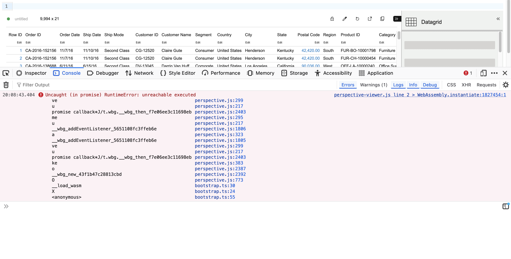

Perspective + Codemirror 6 bug
===

Reproduction of Perspective bug: [#2635](https://github.com/finos/perspective/issues/2635)

## Steps to reproduce

1. Install dependencies

```sh
npm i 
```

2. Run `npm start`

Open it in a browser: http://localhost:1234

You should see an error like this:



Downgrade the perspective version files in `src/index.html` from 2.10.0 and the error will go away.
